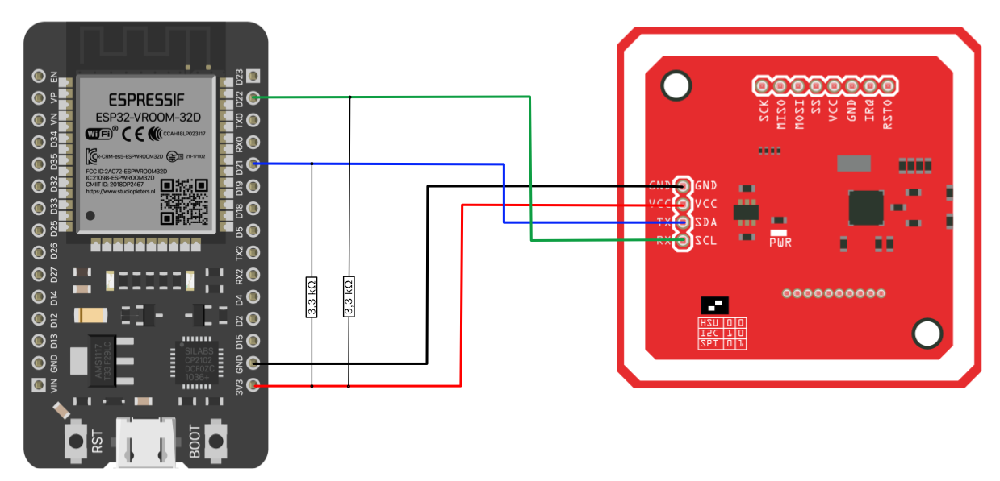

# NFC 2 BLE
Is a small software that reads and RFID chip and forwards the UID by emulating an bluetooth keyboard (HID).

This allows for simple RFID scans to many hardware as tablets or laptops.

## Hardware
- ESP32
- PN532 (or similar)

## Circuit Diagram

| ESP32 | PN532 |
|-------|-------|
| D22   | SCL   |
| D21   | SDA   |
| GND   | GND   |
| 3,3V  | VCC   |

Add 2 pull-up resistors of 3,3kΩ between VCC and both I2C lines.

## Compile
To compile this I used [Platform.io](https://platformio.org/)

## External Sources
 - [PN532 Library](https://github.com/elechouse/PN532) ( see lib folder )
 - [Tutorial: ESP32 and NFC over I2C ](
https://warlord0blog.wordpress.com/2021/10/09/esp32-and-nfc-over-i2c/)
 - [Example: ESP32 as Bluetooth Keyboard](https://gist.github.com/manuelbl/66f059effc8a7be148adb1f104666467)